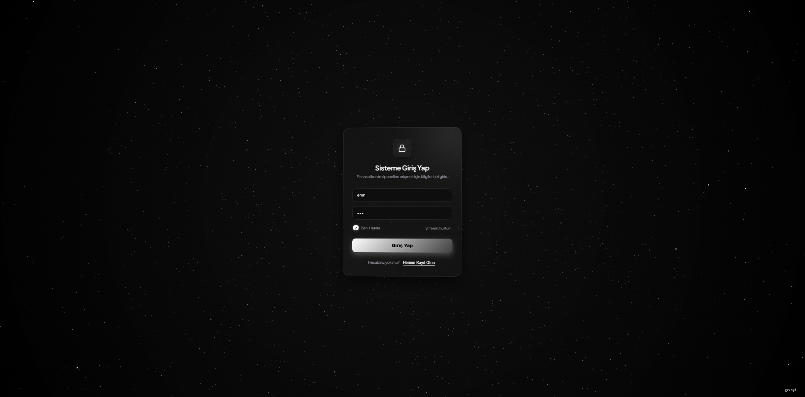
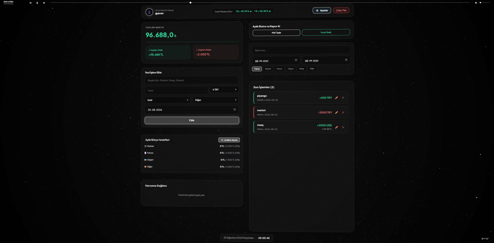
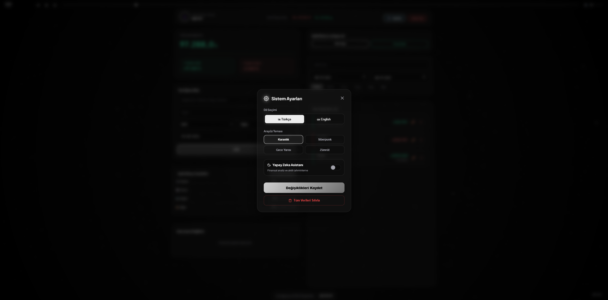

# Finans Uygulaması: Bütçe ve Portföy Yönetim Sistemi

Modern web teknolojileri (React & Vite) kullanılarak geliştirilmiş; çok kullanıcılı, canlı kur destekli, gelişmiş raporlama özelliklerine sahip kişisel finans yönetim uygulaması. 

## Öne Çıkan Özellikler

- **İzole Oturum ve Çoklu Kullanıcı Sistemi:** Birden fazla kullanıcının verilerinin birbirine karışmadığı, "Beni Hatırla" özellikli tam kontrollü giriş ekranı.
- **Canlı Döviz Kuru Entegrasyonu:** Dış API üzerinden anlık döviz kurlarını çekerek portföy değerini dinamik olarak hesaplama.
- **Yapay Zeka Finansal Asistan:** Kullanıcının harcama alışkanlıklarını analiz ederek tavsiyelerde bulunan akıllı asistan modülü.
- **Dinamik Tema ve UI Motoru:** Glassmorphism (cam efekti) tabanlı tasarım. Kullanıcının tercihine göre anında değişebilen 4 farklı özel tema.
- **Gelişmiş Raporlama ve Dışa Aktarım:** Seçilen tarih aralığına ve kategoriye göre filtrelenen harcamaların PDF ve Excel formatlarında dışa aktarılabilmesi.
- **Entegre Radyo Çalar (Auto-Shuffle):** Sistemde gezinirken arka planda çalışan, gizlenebilir ve her girişte rastgele şarkı ile başlayan entegre radyo.
- **Çoklu Dil Desteği:** Türkçe (TR) ve İngilizce (EN) arasında anında geçiş yapabilme imkanı.
- **Gelişmiş Animasyonlar:** Framer Motion ile güçlendirilmiş arayüz ve akıcı sayfa geçişleri.

## Kullanılan Teknolojiler

**Frontend:**
- React.js (Hooks & Component Architecture)
- Vite
- Framer Motion
- CSS3 (Custom Properties, Glassmorphism)
- Recharts (Veri görselleştirme)
- React Hot Toast

**Backend / Veri Yönetimi:**
- JSON-Server (REST API Simülasyonu)
- Fetch API
- LocalStorage / SessionStorage

## Ekran Görüntüleri

**Giriş Ekranı**  

**Ana Dashboard**  

**Ayarlar ve Tema Yönetimi**  

## Kurulum ve Çalıştırma

Projeyi yerel bilgisayarınızda çalıştırmak oldukça basittir. Terminaliniz üzerinden projeyi klonlayıp (`git clone https://github.com/VRGL35/finans-uygulamasi.git`), proje klasörüne girerek (`cd finans-uygulamasi`) gerekli bağımlılıkları `npm install` komutu ile yükleyin. Kurulum tamamlandıktan sonra uygulamayı ve API sunucusunu ayrı ayrı çalıştırmakla uğraşmanıza gerek yoktur; doğrudan klasör içinde bulunan **`baslat.bat`** dosyasına çift tıklayarak (veya terminalde `./baslat.bat` yazarak) tüm sistemi tek seferde ayağa kaldırabilirsiniz.

*(Not: .bat dosyasını kullanmak istemezseniz, iki ayrı terminalde sırasıyla `npx json-server --watch db.json --port 5000` ve `npm run dev` komutlarını çalıştırarak da sistemi manuel başlatabilirsiniz.)*

---
**Geliştirici:** [VRGL35](https://github.com/VRGL35)
*İletişim ve geri bildirimleriniz için LinkedIn üzerinden bana ulaşabilirsiniz: [LinkedIn Profilim](<https://www.linkedin.com/in/eren-vergil-11b110371/>)*
